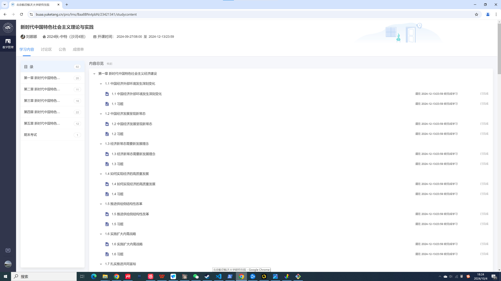

@[TOC](ReadMe)
# 简介

 - 一个能够一键播放新中特所有网课的程序（目前可能有较多bug）
 - one_click一键播放所有网课，如有遗漏，可以多运行几次one_click

# 环境部署
**step 0**.  从官方网站下载[Miniconda](https://docs.anaconda.com/miniconda/)
**step 1**. 创建一个conda环境并激活它
> conda create --name oneclick python=3.8 -y
> conda activate oneclick 

**step 2**. 安装必要的依赖库

> pip install selenium
> pip install Beautifulsoup4 

# 使用指南
打开cmd，在命令行中输入如下命令，先进入chrome.exe存放的文件目录，然后打开chrome浏览器：

> cd C:\Program Files\Google\Chrome\Application\
> chrome.exe --remote-debugging-port=9222 --user-data-dir="C:\selenum\AutomationProfile"

此时会打开一个浏览器页面，输入网址[https://buaa.yuketang.cn/pro/portal/home/](https://buaa.yuketang.cn/pro/portal/home/)，登录自己的学习账号，调整到下面的界面

此时，运行one_click.py，即可自动播放所有课程

 

